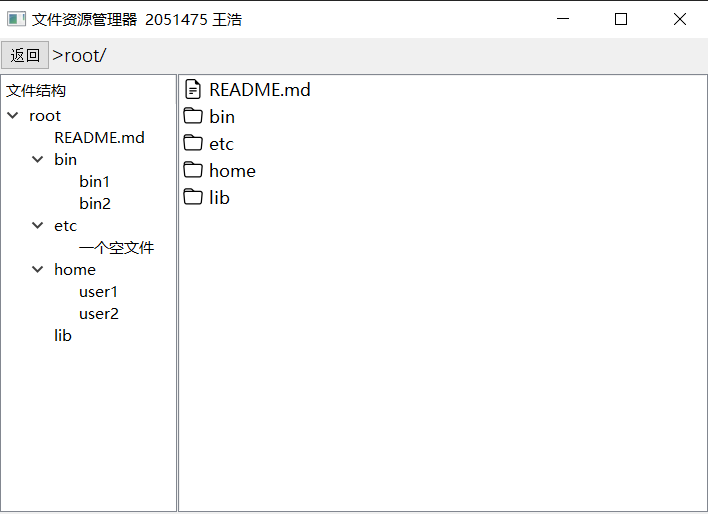
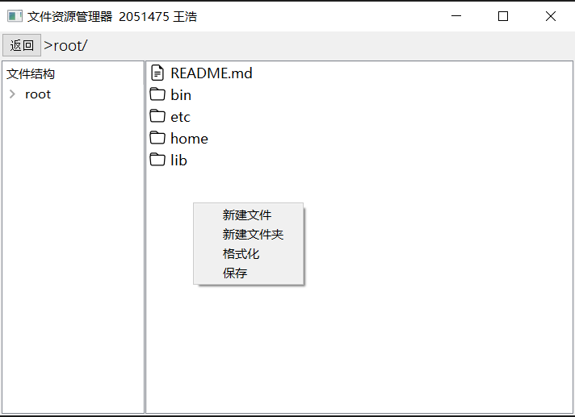
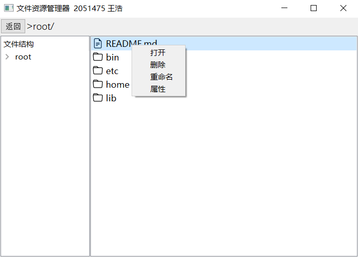

# FileManagement

## 项目简介

该项目在内存中开辟一个空间作为文件存储器，在其上实现一个简单的文件系统。可以将该文件系统的内容保存到磁盘上，以便下次可以将其恢复到内存中来。

文件存储空间管理采取索引结构，空闲空间管理可采用位图，文件目录采用多级目录结构。

采取字符作为文件存储器的大小单位，默认情况下可以容纳 $1024 \times 1024$ 个字符（暂不支持自定义空间大小）

## 项目结构

项目包含以下文件：

**为了避免作业抄袭，代码文件等暂不上传。**

```
├── Storage.py        # 模拟磁盘
├── File.py           # 模拟目录
├── System.py         # 模拟文件系统
├── Dialog.py         # 设计对话框
├── Ui_Window.py      # 设计主界面
├── main.py           # 程序执行入口
├── main.exe          # 可执行文件
│
├── Window.ui         # Qt Designer生成文件
│
├── disk.pickle       # 磁盘存储文件
├── catalog.pickle    # 目录存储文件
│
├── .gitignore        # git忽略配置
├── requirements.txt  # 项目依赖项
│
├── README.md         # 项目说明文档
├── report.md         # 项目设计文档
│
├── icons             # 图标文件夹
│   ├── file.svg      # 文件图标
│   └── folder.svg    # 文件夹图标
│
└── images            # 文档需要的图片
    ├── ...
    └── ...
```

## 说明

如果同一路径下有 `disk.pickle` 和 `catalog.pickle` 文件，程序会将它们加载进文件系统，否则新建空的文件系统。

关闭程序前可以在图标区域空白处右击选择“保存”，将用户做的更改存入 `disk.pickle` 和 `catalog.pickle` 文件，否则更改不会被记录，下次运行仍然是上次保存的内容。

在图标区域空白处右击选择“格式化”，会清空文件系统，但不会修改 `disk.pickle` 和 `catalog.pickle` 文件。

请确保 `main.py` 或 `main.exe` 与文件夹 `icons` 处在同一目录，否则无法显示图标。

更新文件内容时，会先试图创建一个具有新内容的文件，创建成功后删掉旧文件。因此，如果磁盘块被占满，即使要更新的文件所在的块仍有空间时，更新这个文件也会报错，这一点有待优化。

## 如何运行

界面演示



空白处右击菜单



图标右击菜单



### 方法一：

直接运行 `main.exe`

### 方法二：

**1. 安装 python**

该项目使用 `python3.10.9` 请至少确保环境中安装了 `python3`

使用指令：

```shell
python --version
```

来检查环境中 `python` 的版本


**2. 安装依赖项**

使用指令：

```shell
pip install -r requirements.txt
```

来安装项目运行需要的依赖项

其中 `pyqt5-tools==5.15.9.3.3` 是使用 QtDesigner 设计界面的依赖项，如果没有更改界面的需求可以不安装。

**3. 运行程序**

使用指令：

```shell
python .\main.py
```

来运行项目
