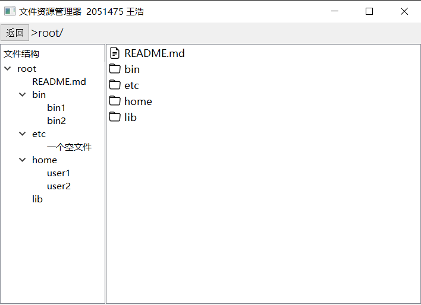
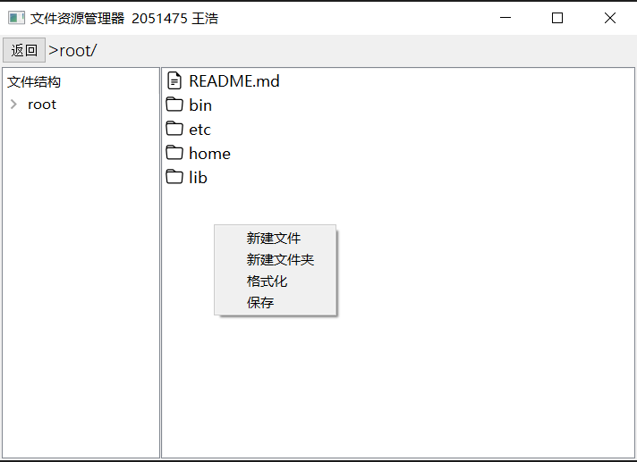
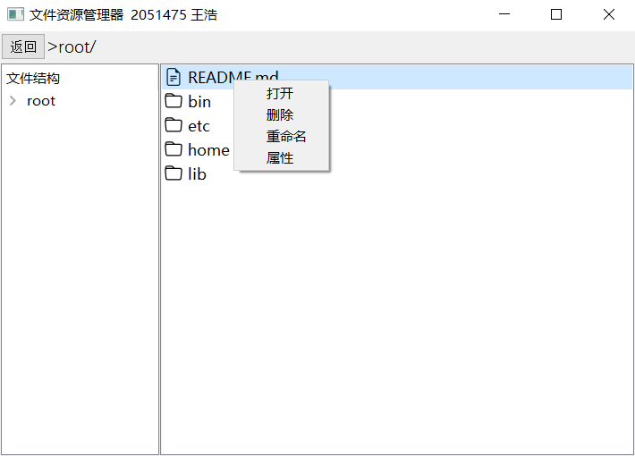

# <center> 文件管理项目设计方案

<div style="text-align:center">2051475 王浩</div>

## 项目简介

### 1. 项目目的

- 理解文件存储空间的管理；

- 掌握文件的物理结构、目录结构和文件操作；

- 实现简单文件系统管理；

- 加深文件系统实现过程的理解；

### 2. 开发环境

操作系统平台：windows10

开发框架：PyQt5

### 3. 项目需求

该项目在内存中开辟一个空间作为文件存储器，在其上实现一个简单的文件系统。可以将该文件系统的内容保存到磁盘上，以便下次可以将其恢复到内存中来。

本项目的文件存储空间管理采取**索引结构**，空闲空间管理采用**位图**，文件目录采用**多级目录结构**。

采取字符作为文件存储器的大小单位，默认情况下可以容纳 $1024 \times 1024$ 个字符（暂不支持自定义空间大小）

### 4. 文件结构

```
├── Storage.py        # 模拟磁盘
├── File.py           # 模拟目录
├── System.py         # 模拟文件系统
├── Dialog.py         # 设计对话框
├── Ui_Window.py      # 设计主界面
├── main.py           # 程序执行入口
├── main.exe          # 可执行文件
│
├── disk.pickle       # 磁盘存储文件
├── catalog.pickle    # 目录存储文件
│
├── requirements.txt  # 项目依赖项
│
├── report.md         # 项目设计文档
│
├── icons             # 图标文件夹
│   ├── file.svg      # 文件图标
│   └── folder.svg    # 文件夹图标
│
└── images            # 文档需要的图片
    ├── ...
    └── ...
```

## 模块设计

### 1. Storage

该模块实现了一个简单的磁盘存储系统的模拟。它包含两个类：Block和Disk。

该模块模拟了磁盘存储系统的基本操作，包括物理块的读、写、清除操作，磁盘的读、写、清除，以及分配空闲物理块等操作。

#### Block类

Block类用于模拟磁盘上的物理块。每个物理块具有固定的容量，并可以存储数据。该类具有以下属性和方法：

属性

- id: 物理块的唯一标识符，用于区分不同的块
- capacity: 物理块的容量，表示能够存储的最大数据量
- data: 存储在物理块中的数据

方法

- show_info(): 打印当前物理块的详细信息，包括标识符、容量和存储的数据
- read_block(): 从物理块中读取数据，并返回读取的内容
- write_block(data): 向物理块中写入数据，如果写入内容超过物理块的容量，截取部分内容进行写入，并返回未写入的内容
- clear_block(): 清空物理块中的数据

#### Disk类

Disk类用于模拟整个磁盘，它由多个物理块组成，并维护了一个位示图来表示物理块的使用情况。该类具有以下属性和方法：

属性

- block_num: 磁盘上物理块的数量
- block_size: 每个物理块的容量
- bitmap: 位示图，用于表示物理块的使用情况，0表示未使用，1表示已使用
- blocks: 存储磁盘上所有的物理块对象的列表

方法

- show_info(): 打印磁盘的详细信息，包括物理块数量、每个物理块的容量和位示图的状态
- read(table): 根据给定的索引表，从磁盘中读取相应的物理块，并将它们的内容合并为一个字符串返回
- allocate_block(): 分配一个空闲物理块，更新位示图并返回该物理块的编号
- write(data): 将数据写入磁盘的空闲物理块中，如果数据量超过可用的物理块容量，将数据分段写入多个物理块，并返回写入的结果和索引表
- clear(table): 清空给定索引表中指定的物理块，将对应的位示图标记为未使用，并清空物理块中的数据

### 2. File

该模块实现了文件和文件夹的模拟，分别由File类和Directory类表示。

该模块模拟了文件和文件夹的基本操作，包括获取文件和文件夹的详细信息、重命名文件和文件夹、添加和移除文件以及添加和移除子文件夹等操作。

#### File类

File类用于模拟文件控制块中的文件。每个文件具有名称、路径、索引表等属性，并记录了文件的创建时间和最近修改时间。该类具有以下属性和方法：

属性

- name: 文件名称
- type: 文件类型，固定为'file'
- path: 文件路径
- table: 索引表所在物理块的索引
- creation_time: 文件创建时间
- last_modified_time: 文件最近修改时间

方法

- show_info(): 打印当前文件的详细信息，包括名称、类型、路径、索引表、创建时间和最近修改时间
- update_last_modified_time(): 更新文件的最近修改时间为当前时间
- rename(new_name): 重命名文件，更新文件名称和最近修改时间

#### Directory类

Directory类用于模拟文件夹。每个文件夹具有名称、路径、父文件夹等属性，并记录了文件夹的创建时间和最近修改时间。该类具有以下属性和方法：

属性

- name: 文件夹名称
- type: 文件夹类型，固定为'dir'
- path: 文件夹路径
- father: 父文件夹对象
- creation_time: 文件夹创建时间
- last_modified_time: 文件夹最近修改时间
- files: 文件夹内的文件列表
- dirs: 文件夹内的子文件夹列表

方法

- show_info(): 打印当前文件夹的详细信息，包括名称、类型、路径、父文件夹、创建时间、最近修改时间、文件列表和子文件夹列表
- update_last_modified_time(): 更新文件夹的最近修改时间为当前时间
- rename(new_name): 重命名文件夹，更新文件夹名称和最近修改时间
- add_file(file): 向文件夹中添加文件，更新最近修改时间
- add_dir(dir): 向文件夹中添加子文件夹，更新最近修改时间
- remove_file(file): 从文件夹中移除文件，更新最近修改时间
- remove_dir(dir): 从文件夹中移除子文件夹，更新最近修改时间

### 3. System

该模块实现了模拟文件系统的功能，包括磁盘管理和目录管理，以及文件和文件夹的增删改查等操作。

#### 函数

- load_from_file(filename): 从本地加载数据，根据指定的文件名加载数据并返回。
- save_to_file(filename, data): 将数据保存到本地，将指定的数据保存到指定的文件名中。

#### FileSystem类

FileSystem类用于模拟文件系统的操作。它包含了磁盘管理和目录管理的功能，并提供了对文件和文件夹的增删改查等操作。该类具有以下属性和方法：

属性

- disk: 磁盘对象，用于模拟磁盘的管理。
- root: 根目录对象，表示文件系统的根目录。
- cur_dir: 当前所在目录对象，表示当前工作目录。

方法

- get_cur_path(): 获取当前路径，返回当前所在目录的完整路径。
- get_cur_content(): 获取当前路径下的所有文件和文件夹，返回当前目录中的文件列表和文件夹列表。
- cd_forward(selected_dir): 进入指定目录，将当前目录切换为指定的文件夹对象。
- cd_backward(): 返回上一级目录，将当前目录切换为父文件夹对象。
- add_dir(dir_name): 添加文件夹，创建一个新的文件夹对象并将其添加到当前目录中。
- add_file(file_name): 添加文件，创建一个新的文件对象并将其添加到当前目录中。
- del_dir(selected_dir): 删除文件夹，从当前目录中移除指定的文件夹对象。
- del_file(selected_file): 删除文件，从当前目录中移除指定的文件对象，并清空文件在磁盘上的数据。
- rename_dir(selected_dir, new_name): 重命名文件夹，将指定文件夹对象的名称修改为新的名称。
- rename_file(selected_file, new_name): 重命名文件，将指定文件对象的名称修改为新的名称。
- read_file(selected_file): 读取文件内容，返回指定文件对象在磁盘上的数据。
- write_file(selected_file, data): 向文件写入数据，将指定数据写入磁盘，并更新文件对象的索引表和最近修改时间。
- format_system(): 格式化文件系统，清空磁盘和目录，创建一个新的根目录对象和磁盘对象。
- save_system(): 保存文件系统，将磁盘对象和根目录对象保存到本地文件。

### 4. Dialog

该模块实现了一些对话框类，包括命名对话框、属性对话框、文件对话框和错误提示对话框，用于界面交互和显示相关信息。。

#### NewItemDialog类

NewItemDialog类是一个命名对话框，用于获取用户输入的名称。它具有以下属性和方法：

属性

- label: QLabel对象，用于显示提示信息。
- input_line: QLineEdit对象，用于用户输入名称。
- ok_button: QPushButton对象，用于确认用户输入。
- cancel_button: QPushButton对象，用于取消用户输入。

方法

- get_input_text(): 获取输入框中的文本，返回用户输入的名称。

#### AttributeDialog类

AttributeDialog类是一个属性对话框，用于显示文件或文件夹的属性信息。它具有以下属性：

属性

- name: 文件或文件夹的名称。
- f_type: 类型，表示是文件还是文件夹。
- path: 路径，表示文件或文件夹的路径。
- creation_time: 创建时间，表示文件或文件夹的创建时间。
- last_modified_time: 最近修改时间，表示文件或文件夹的最近修改时间。
- table (可选): 索引表，表示文件的索引表。

#### EditDialog类

EditDialog类是一个文件对话框，用于编辑文件的内容。它具有以下属性和方法：

属性

- editText: QTextEdit对象，用于编辑文件的文本内容。
- saveButton: QPushButton对象，用于保存文件的修改。

方法

- return_data(): 返回编辑后的文件内容，将用户编辑的文本内容返回。

#### ErrorDialog类

ErrorDialog类是一个错误提示对话框，用于显示错误信息。

### 5. Ui_Window

该模块的功能是定义了文件资源管理器的用户界面。它通过使用Qt的图形用户界面库（PyQt5）提供的类和方法，创建了一个可视化的主窗口，并配置了其中的各个部件。

#### Ui_MainWindow类

属性

- centralwidget: 表示主窗口的中央部件，是一个QWidget对象。
- verticalLayout: 表示中央部件的垂直布局，是一个QVBoxLayout对象。
- top_frame: 顶部框架，是一个QFrame对象，用于显示返回按钮和路径标签。
- horizontalLayout: 顶部框架的水平布局，是一个QHBoxLayout对象。
- back_button: 返回按钮，是一个QPushButton对象，用于返回上一级目录。
- path_label: 路径标签，是一个QLabel对象，用于显示当前路径。
- bottom_frame: 底部框架，是一个QFrame对象，用于显示文件结构和文件列表。
- horizontalLayout_2: 底部框架的水平布局，是一个QHBoxLayout对象。
- treeWidget: 文件结构树，是一个QTreeWidget对象，用于显示文件和文件夹的层级结构。
- listWidget: 文件列表，是一个QListWidget对象，用于显示当前文件夹中的文件和文件夹列表。

方法

- setupUi(self, MainWindow): 用于设置主窗口的属性、布局和部件的样式。
- retranslateUi(self, MainWindow): 用于设置主窗口和部件的文本内容。

### 6. main

该模块是一个文件管理器的主要模块，它使用PyQt5库创建了一个图形用户界面 (GUI)。

#### MainWindow类

MainWindow类是一个继承自QMainWindow和Ui_MainWindow的自定义类，用于实现文件管理系统的主窗口。它负责处理用户界面的交互和文件系统的操作。它具有以下属性和方法：

属性

- fs：FileSystem类的实例，用于管理文件系统。
- path_label：QLabel类的实例，用于显示当前路径的标签。
- tree_widget：QTreeWidget类的实例，用于显示文件树。
- list_widget：QListWidget类的实例，用于显示文件列表。
- current_item：QTreeWidgetItem类的实例，表示当前选中的文件或文件夹项。

方法

- update_path方法：更新当前路径的标签文本，显示当前路径。
- update_tree方法：更新文件树，根据文件系统的目录结构更新显示在treeWidget控件中的文件树。
- update_list方法：更新文件列表，根据文件系统的当前路径，更新显示在listWidget控件中的文件列表。为每个文件和文件夹设置图标，并设置字体样式。
- show_menu方法：显示列表的上下文菜单，并根据右击的位置选择不同的菜单。
- show_list_menu方法：显示文件列表的菜单，并处理用户选择的操作。
- show_item_menu方法：显示文件或文件夹项的菜单，并处理用户选择的操作。
- new_file方法：新建文件，创建NewFileDialog对话框，获取用户输入的文件名，并在文件系统中创建文件。
- new_dir方法：新建文件夹，创建NewDirDialog对话框，获取用户输入的文件夹名称，并在文件系统中创建文件夹。
- format_all方法：格式化磁盘和目录，调用文件系统的format_system方法。
- save_all方法：保存磁盘和目录，调用文件系统的save_system方法。
- open方法：打开文件或进入文件夹，根据用户选择的项判断是打开文件还是进入文件夹，并执行相应的操作。
- enter_dir方法：进入文件夹，根据文件夹名称在文件系统中进行路径切换，并更新界面显示。
- open_file方法：打开文件，根据文件名在文件系统中找到文件，并显示文件内容。如果用户进行了保存操作，则更新文件内容。
- back_parent方法：返回上级目录，通过文件系统的cd_backward方法进行路径切换，并更新界面显示。
- rename方法：重命名文件或文件夹，根据用户选择的项获取原名称，并创建RenameDialog对话框获取用户输入的新名称。在文件系统中执行重命名操作，并更新界面显示。
- delete方法：删除文件或文件夹，根据用户选择的项在文件系统中执行删除操作，并更新界面显示。
- show_attribute方法：显示文件或文件夹的属性，根据用户选择的项在文件系统中获取属性，并显示在AttributeDialog对话框中。

#### 主函数

主函数负责创建应用程序对象、主窗口对象，并启动应用程序的事件循环，从而使文件管理系统的界面能够响应用户的操作和交互。

首先，创建了一个QApplication对象，它是Qt应用程序的核心对象，用于处理应用程序的事件循环和管理应用程序的资源。

然后，创建了一个MainWindow对象，即文件管理系统的主窗口。

接下来，通过调用show()方法显示主窗口。

最后，通过调用app.exec_()方法启动应用程序的事件循环，使应用程序进入运行状态，等待用户的交互和事件处理。

sys.exit(app.exec_())用于在应用程序退出时，确保应用程序的退出状态码正确返回给操作系统。

## 功能设计

界面演示



空白处右击菜单



图标右击菜单



#### 1. 新建文件

在图标区域的空白处右击显示菜单，选择"新建文件"，然后输入文件名即可创建一个空白文件。在同一目录下，文件名不能重复，否则新建文件会失败。但是文件和文件夹的命名可以重复。

#### 2. 新建文件夹

在图标区域的空白处右击显示菜单，选择"新建文件夹"，然后输入文件夹名即可创建一个新的文件夹。在同一目录下，文件夹名不能重复，否则新建文件夹会失败。但是文件和文件夹的命名可以重复。

#### 3. 保存

在图标区域的空白处右击显示菜单，选择"保存"，将会把用户的更改保存到"disk.pickle"和"catalog.pickle"文件中。如果不保存，用户的更改将不会被记录，下次运行程序时将继续使用上次保存的内容。

运行程序时，如果当前路径下存在"disk.pickle"和"catalog.pickle"文件，程序会加载它们来还原文件系统；否则，会创建一个空的文件系统。

#### 4. 格式化

在图标区域的空白处右击显示菜单，选择"格式化"，将会清空文件系统，但不会修改"disk.pickle"和"catalog.pickle"文件。

#### 5. 打开文件/文件夹

在文件图标上右击显示菜单，选择"打开"，即可打开文件。打开文件后，会出现一个窗口显示文件的内容。用户可以编辑窗口中的内容，并保存到文件中。

在文件夹图标上右击显示菜单，选择"打开"，即可打开文件夹。打开文件夹后，会进入文件夹内部。程序界面会更新当前路径，并以图标的形式显示文件夹内部的文件和文件夹。

#### 6. 删除文件/文件夹

在文件/文件夹图标上右击显示菜单，选择"删除"，即可删除文件或文件夹。

#### 7. 重命名文件/文件夹

在文件/文件夹图标上右击显示菜单，选择"重命名"，即可对文件或文件夹进行重命名。

在同一目录下，文件名不能重复，文件夹名也不能重复，否则重命名会失败。但是文件和文件夹的命名可以重复。

#### 8. 查看文件/文件夹属性

在文件/文件夹图标上右击显示菜单，选择"属性"，即可查看文件/文件夹的属性。

属性包括名称、类型、路径、创建时间、最近修改时间。对于文件，还会显示存储位置的索引表。

#### 9. 返回上级目录

点击程序窗口左上角的按钮即可返回上级目录。如果当前处于根结点，无法返回上级目录。